# Devlog

The diary of this project and the one before it. One story, appended to,
rather than a pile of numbered posts.

The illustrated version is published separately; this file is the same
text, in the repo, so it outlives any hosting. **Do not edit it by
hand** — it is assembled from `devlog/*/article.md` by
`node tools/devlog.mjs`.


---

# The learning islands

*Devlog 0001. My son is in year one. I had a folder of documentation and no code. Twelve hours later there was a learning app on GitHub Pages with a voice, three islands and handwriting — and a list of bugs that all typechecked perfectly.*

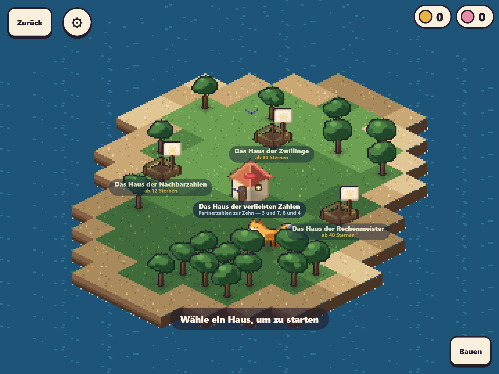

This one is not about Tidegarden. It is a different project with the same method, and I think that is the interesting part: everything I learned making a game with an agent transferred directly to making something for my son.

The short version of the brief: he is learning **Zahlenfreunde** — the pairs that add to ten. One and nine. Two and eight. Knowing those cold is one of the real turning points in early arithmetic, and I wanted something aimed at exactly what his class is doing this month.

We use ANTON at home. It is good. But the games in it are an endless runner and a Flappy Bird clone, and they have nothing to do with the maths. I wanted to show him — and honestly, to show other parents — that a game can be beautiful, and that the learning can be the game rather than the toll you pay to reach it.

## I started with documents and no code

The folder had four markdown files and nothing else. A design document, a rules file, an iPad file, and a handover. I had written them in a previous session deliberately, and this is the first thing I would tell anyone starting a project this way.

The rules file is the one that does the work. Not "write clean code" — actual rules with actual reasons:

> *Nothing that faces the user is written inline. Every string goes through a table from the first commit. Retrofitting this cost a week elsewhere; doing it on day one costs nothing.*

> *There is no fail state and no way to reach one. No red X, no buzzer, no "wrong", no score that can go down. A mistake shows the right answer as a picture and moves on.*

**Method: give the agent a rules file early, and attach the reason to every rule.** A rule without its reason gets followed literally and wrongly. A rule with its reason gets applied to situations you did not think of — and I watched that happen about six times over the day.

## The first thing I changed was the whole shape

The documents described a "Lernkiste", a learning box, with a meadow that fills up with creatures as you master number pairs.

I looked at it and asked for something else: islands. A child picks an island, walks up to a house, goes in, does ten questions, and earns points to make the island theirs. Two currencies. Stars that only ever go up, and sweets to spend.

The design document argued *against* points. It said streaks punish the day you were ill, and stars out of three turn practice into a graded test. It was right about all of that. What I got back was not a shrug — it was a new section appended to the design document that answered the objection rather than deleting it:

> *Sterne only ever go up. They are a record of what has been learned and they unlock houses. Bonbons are the only number in the app that can go down, and only because the child chose to spend them on a sheep — that is agency, not punishment.*

**Method: when you overrule a design document, make the agent write down why, in the document.** Otherwise you get an app whose rules and whose docs disagree, and in three weeks neither of you knows which one was the decision.

## Everything is drawn in code

No image files. Not one. Every tree, every house, every animal is a function that returns a pixel buffer, on a closed palette of about a hundred and twenty colours lifted straight from Tidegarden.

That decision pays twice. Variety is free — one function makes a family of houses rather than one house. And the fourth fruit tree costs one line, because apple, pear and plum are the same generator with a different leaf ramp and fruit ramp.

The shading rule is the same one Tidegarden runs on: **shading is stepping along a ramp, never multiplying a colour.** Multiplying gives you the same hue at lower brightness, which is exactly what makes cheap art look muddy.

## Five bugs that typechecked, ran clean, and were completely obvious in a screenshot

This is the part worth the whole post.

**The device pixel ratio.** The renderer did `ctx.setTransform(scale, 0, 0, scale, 0, 0)`, which threw away the `dpr` transform the caller had already set. The island drew at half size in the top-left quarter of the canvas. Invisible at dpr 1 — which is every desktop browser at default zoom — and obvious on an iPad.

**The ink rim traced the ground shadow.** Every tree, animal and building stood in a little black box. The outline routine outlines anything with alpha above 8, and a soft contact shadow is alpha 13 to 70. The fix was ordering, not logic: the shadow goes on *after* the rim.

**Tile-space neighbours confused with screen-space ones.** In this projection the tile at `(x, y-1)` is up and to the *right*. The foam code assumed left, so surf appeared on the wrong side of every coastal tile and drew long diagonal streaks across open water.

**A full-screen layer that ate every tap.** `#ui > * { pointer-events: auto }` beat the plain `pointer-events: none` on the house-label layer, so the island and every button under it went dead. The app looked completely normal in a screenshot. The only thing that noticed was a Playwright `tap()` timing out.

**Particles under the interface.** The end-of-round panel paints across the whole screen, and the effects canvas was below it — so the stars flying into the counter, the one moment the entire reward is built around, were invisible.

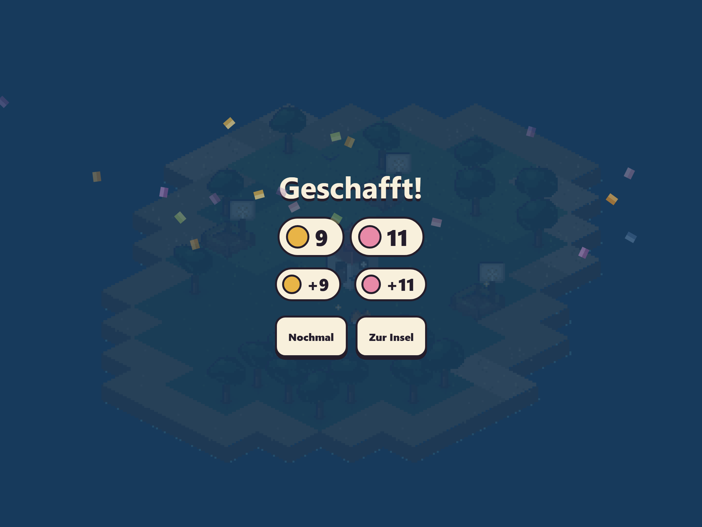

Every one of those passed the typechecker. Every one ran without an error. **Method: review the artefact, not the diff.** Make the agent take a screenshot at the real device size and then *look at it yourself*.

## The contact sheets

The single highest-value tool in the project, and it is forty lines.

It bundles the sprite module on its own, draws everything it exports onto one canvas, and screenshots it. Three of them ended up existing: word pictures, island sprites, and the writing alphabet.

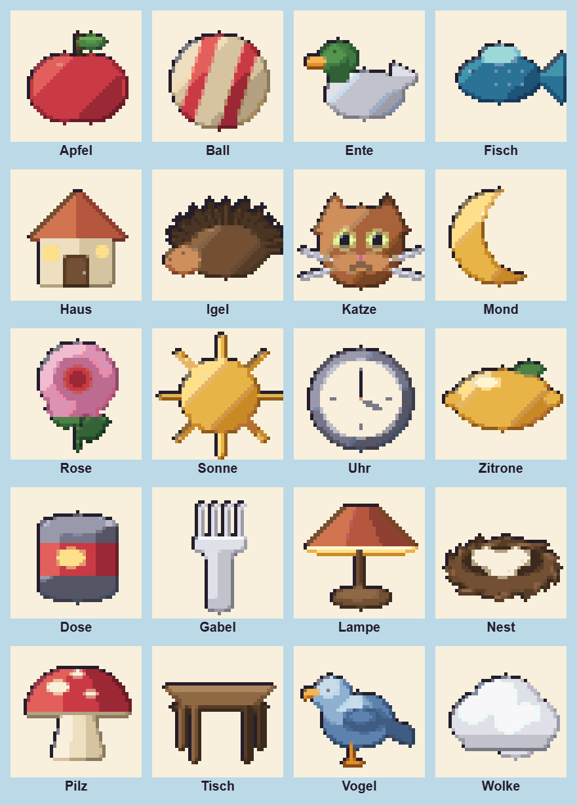

The first twelve word pictures went in and four were bad. The cat had its ears tucked inside the head outline where they vanished, and whiskers crossing its face — a round brown blob that read as an animal in pain. The duck's tail was a one-pixel diagonal that read as an aerial. The hedgehog was a potato with a nose.

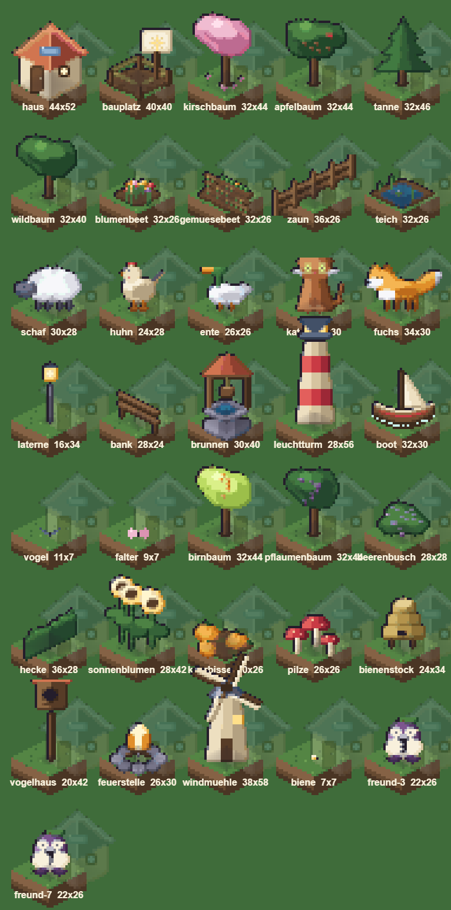

The island sheet was worse: six of twenty-two sprites were wrong. The well was a grey blob with an orange trapezoid hovering over it, because the roof was drawn wider than its posts and never met them. The boat was a white triangle over a smudge — the hull was dark on dark water and simply vanished.

And the sheep was Tidegarden's oldest lesson happening a second time. It read as a white pebble. The fix was the same both times: **the fleece has to be bright and bumpy and the head has to be dark and outside it.** Contrast between the parts is what makes a small thing legible.

**Method: judge a sprite at the size and on the background it will actually be seen.** The island sheet draws each sprite at island scale, on the ground tile it stands on, with a house behind it for reference. Judging one alone at 8× on white is how you end up with a fox the size of a cottage.

The deeper lesson was about generalisation. There had been a shared `critter()` body plan — an ellipse with four dots for legs — and it produced five animals that all read as the same grey lump. Each had to be drawn on its own before any of them worked: the hen upright with a comb, the cat *sitting*, the duck with its head up on a neck, the fox a triangle with a brush. **A shared anatomy is right for a family of buildings and wrong for a family of animals.**

## The voice

Short lines are read aloud, because he is six and cannot reliably read an instruction. That is not a nicety; the rules file says no text may be load-bearing.

ElevenLabs, but **at build time**. The generator reads the string table, sends about 1,900 characters, and writes MP3s into the repo. The running app has never heard of ElevenLabs and makes no network calls at all — which is the only way the offline promise survives. The whole voice set is 89 files and 912KB after ffmpeg trims the silence and drops it to mono.

Three things made it actually feel warm, and only one of them was a knob.

The knob was stability 0.62 to 0.45 with a touch of style. The first pass was correct and flat.

The other two were about repetition, which is the real enemy when a child hears a line a hundred times. **Every house has two greetings** — the full explanation the first time it is opened, a short warm one afterwards. Explaining the rules again on every visit talks down to the child who has just learned them. And **praise comes in three**, picked at random, because the same sentence every time stops being praise and becomes a noise the app makes.

## Turning promises into tests

The rules file said "nothing leaves the device". That was a comment for a week.

It is now a check that watches every request and compares its origin to the page's own, and it will go red the day somebody adds a font from a CDN. Same for "there is no screen that says you did badly" — the suite plays a whole round answering at random and then greps the result screen for *falsch*, *leider*, *schade*, *verloren*.

**Method: turn design promises into assertions.** A promise in a document is a hope. A promise in the test suite is a property of the software.

The suite also caught the two most instructive bugs of the day, and both were bugs *in the tests*.

The round check tapped random cards and asserted that some stars had been awarded. With three cards, ten random taps miss everything about once in sixty runs — and it duly turned the deploy red on a build that was completely fine. Worse: a game that scored the *wrong* card as correct would have sailed straight through it. It now plays the round deliberately, working the answer out from what is on screen, and asserts exactly ten stars and fifteen sweets.

**Method: check that a new test can actually fail.** Before trusting that one, the partner-to-ten was changed from `10 - n` to `9 - n`; the check reported `stars=0` and failed, and passed again when it was put back. Two minutes.

The second was a performance check that went red on a build whose renderer had not changed. It was timing the gaps between animation frames — which in a headless browser is the scheduler and the load on the machine. It read 17ms on an idle laptop and 35ms on a busy one while the actual drawing never moved from about two milliseconds.

Two confident theories died before anybody measured. The new campfire particles: innocent, 2ms. A layout flush in the label placement — reading `getBoundingClientRect` once per label per frame, which genuinely is a bad idea and genuinely was there: also innocent, 0.04ms.

Tidegarden's rule held exactly. **Measure before fixing.** The instrumentation took five minutes and would have taken five minutes at the start.

## The night shift, again

At about midnight I said I was going to bed, and to keep extending it until seven.

In the morning there were fourteen commits.

Hearts instead of circles in the ten-frame — two numbers that make ten are *verliebt*, and the house is named after it, so the counters are hearts and the partner that arrives on a correction is a red one among the pink.

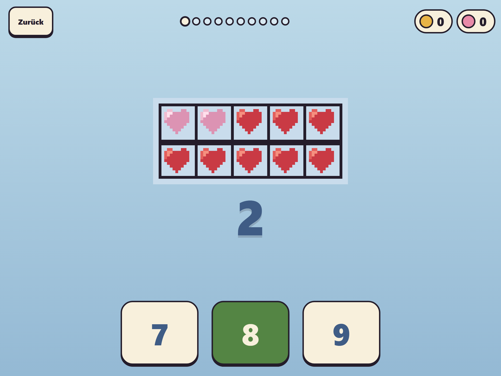

An island that reacts to what you build. Three trees bring birds. A pond brings ducks. A fence gets a sheep, a flower bed gets butterflies, a hive brings bees, and the lighthouse brings a boat across the water. All of it stateless — a pure function of the clock and what has been placed — so a week away costs nothing to resume.

That one is a design argument rather than a feature. Buying a pond and later noticing that the ducks came *on their own* teaches a child something about cause and effect. A duck you simply bought teaches them about a shop.

Day and night on the real clock, so a child playing after dinner sees a different island from the one they saw after school.

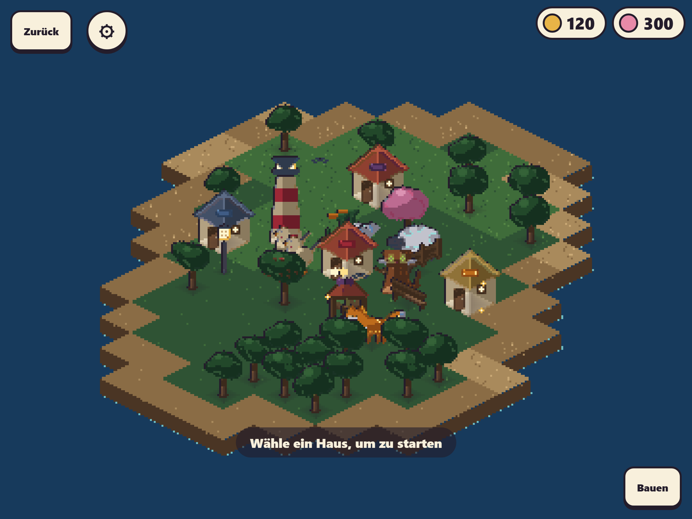

And there is a decision inside that which I like a lot. Night could not be made much darker: every colour steps down its own ramp, and two steps in, most of them clamp to the bottom and the picture loses its contrast. A darker island would have been *less* legible at bedtime and no more atmospheric. So instead of subtracting light, it adds it — lit windows, a lantern, a campfire, and seven fireflies over the wood that blink out of step with each other.

## Writing

The last thing built, and the one I am most pleased with.

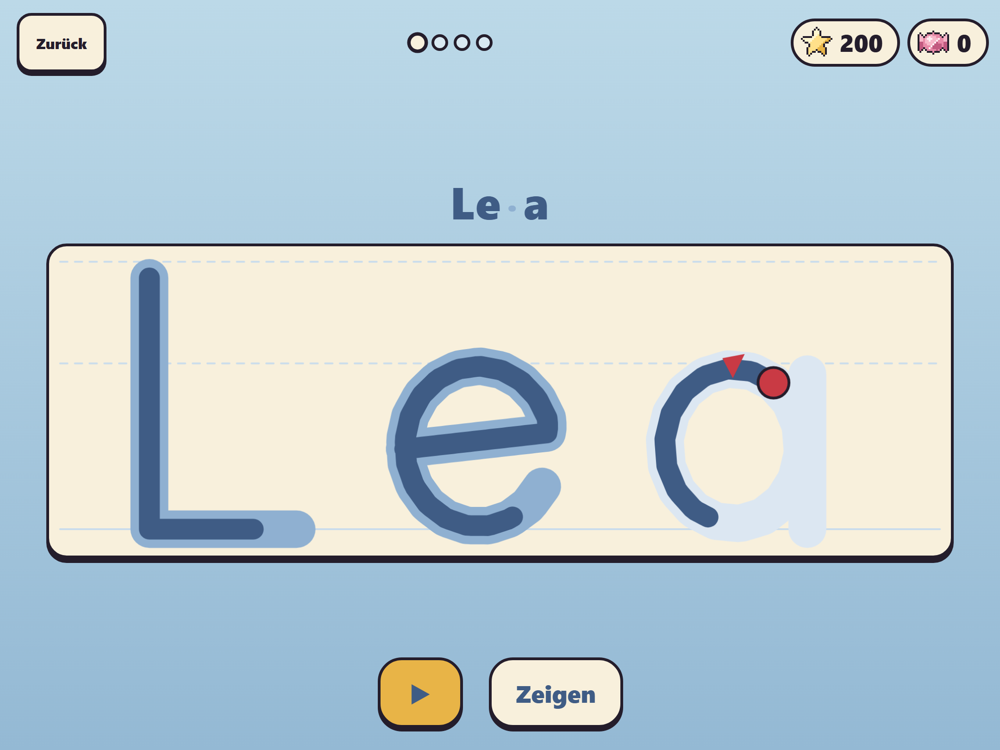

His class writes syllables — La, Li, Mo — and then the words they make: Mama, Oma, Lea, Limo. So the app does too, with a finger.

The obvious way is handwriting recognition. It is the wrong choice, for two reasons, and the second matters more.

A classifier has to **guess**, and a six-year-old's letters vary enormously. Every guess it gets wrong tells a child they wrote it badly when they did not.

But a finished letter **cannot tell you how it was made**. An M drawn from the bottom up looks identical to a correct one and is a habit that costs years. Direction and stroke order are the actual content of first-grade writing, and they only exist while the pencil is moving. Tracing is the only way to see them — so the app checks something a picture-matcher could not.

Which means a **stroke font**: every glyph a list of strokes in the direction a hand really moves, in Grundschrift, with the orders the primers use. Verticals top to bottom. Round letters anti-clockwise from the top. A letter splits where the hand would really lift.

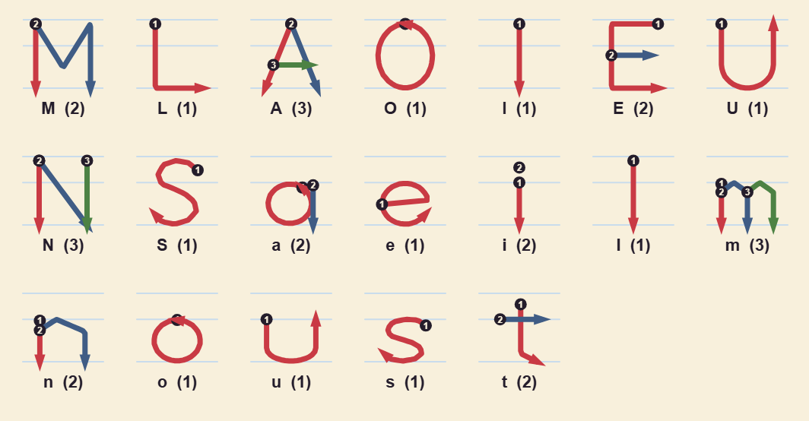

Six of the seventeen glyphs were wrong in the first draft and only a contact sheet showed it. In screen coordinates y grows *downward*, so an increasing angle sweeps clockwise — which made every round letter turn the wrong way and drew both `u` and `U` as arches over the top instead of bowls underneath. All four looked like letters. None of them were.

Note what the sheet had to show to catch that. Not the shape — the shape was fine. It draws every stroke **numbered and arrowed**, because the direction is the content.

**Method: your review artefact has to show the property you care about**, which is often not the obvious one.

The check itself: each stroke is a run of checkpoints, and the child has to touch them in order, each within about a fingertip, without lifting. Forgiving enough that nobody has to be accurate — only to go the right way — and strict enough that a scribble does not pass. Straying does nothing at all. There is no buzzer and nothing to lose.

And the test suite writes. It asks the widget for the stroke it is currently expecting and drags along it, then scribbles straight across a letter first and checks that *nothing happens*. That second assertion is the one that proves the check is real rather than generous. Both found bugs: `Salami` was in the two-syllable word list and has three, and the dot on an `i` is touched rather than drawn, so every syllable with an i in it was ending the test two strokes early.

## Where it is

Three islands, ten houses, twenty-seven things to build, a voice, and handwriting. It is at [patrickgod.github.io/lerninseln](https://patrickgod.github.io/lerninseln/) and it installs to an iPad home screen and works with no signal.

## What is still soft

I played it with my son.

Two findings from one session, and they were not the ones I expected. **Collecting worked** — stars, sweets, coins, a number going up. **Building did not.**

That is the honest result, and the next entry is about what I think it means, because I do not think it means "building is boring". I think it means building was a second job, and that the whole reward structure needs rethinking rather than tuning.

The islands are not going away. But the next thing I make is different.

---

# The playtest, and the pivot

*Devlog 0002. One session with one six-year-old produced two findings and killed half the design. Why "building didn't work" is the wrong diagnosis, why a role-playing game is the right answer, and the one thing an RPG will keep trying to do that would genuinely harm a child.*

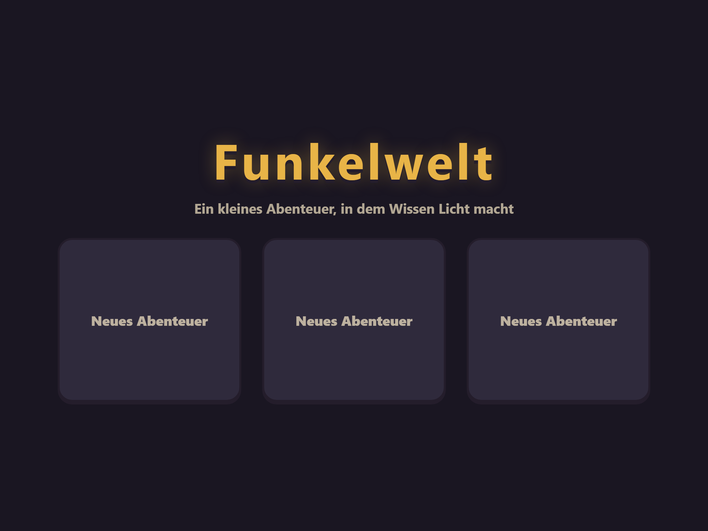

I sat down with my son and the learning islands.

He did the maths. He liked the stars. He liked the sweets. He counted them. When a new house arrived on the island he wanted to know what was in it.

Then he opened the shop, and stopped.

## Two findings

**Collecting worked.** A number going up, arriving on its own, as a consequence of the thing he had just done.

**Building did not.**

That is the whole result. One child, one session, no statistics. I am aware of how thin that is, and I also think it is the most useful data the project has produced.

## The wrong diagnosis

The obvious conclusion is "building is boring, find a better toy". I think that is wrong, and getting it wrong leads straight back to the same problem in a new costume.

Building failed because it is **a second job**.

A child who has just answered ten maths questions is handed a shop, a currency, a catalogue of twenty-seven things, an empty meadow, and no goal — and asked to make an aesthetic decision. That is a blank page. Blank pages are hard for adults and much harder for children.

And the loop was four steps long. Earn, open the shop, choose, place. Only the first step had anything to do with what he had just been doing.

Collecting worked because it is **immediate, visible and automatic**. It happens *to* you.

> **A reward that arrives on its own beats a reward you have to go and spend.** If there is spending, it has to be a short list of obviously-better choices, not a canvas.

I want to flag the shape of that sentence, because it is the useful part. "Building didn't work" is an observation. "A reward you have to go and spend is worse than one that arrives" is a rule I can apply to the next design, and to the one after that.

**Method: make the agent state the general rule, not just fix the thing.** I asked what the playtest actually said rather than asking for the shop to be improved, and what came back was a diagnosis I could build on.

## So what replaces it

I had a hunch and typed it out badly and at length: a small RPG. Character creation, three save slots like old Zelda, a world with dungeons in it, experience, gold, a fairy who explains things.

What I got back was agreement with a reason attached, and the reason was better than my hunch:

> **A role-playing game's core loop is already the learning loop.**
>
> ```
>         RPG                        learning app
>   meet something          →   a set of questions
>   fight it with what      →   answer with what you know
>     you know
>   get stronger            →   the facts get easier
>   reach harder places     →   harder material unlocks
> ```

That is not a theme painted over a quiz. It is the same shape. Which is exactly why it should feel unlike ANTON's endless runner sitting beside a maths test — the game part and the learning part are the *same activity*.

And it fixes the observed problem directly. You do not design anything; getting stronger happens to you. What you buy is on your character, on screen every second, not on a map you have to visit. And a purchase opens a gate, so it is never only decoration.

## The thing that must not happen

Here is the part I would have got wrong on my own.

An RPG says: get it wrong, take damage, eventually lose. Applied to a maths question, that reads as **not knowing this hurts you** — which is precisely the lesson that makes a child decide at seven that they are bad at maths.

So the rule, written into the design document in capitals:

> **Damage goes one way. A wrong answer must never cost the child anything.**

Correct answers push the shadow back. Wrong answers do nothing at all — the right answer is shown as a picture, and the next question comes. The shadow never advances.

There is no health bar. There is **Mut** — courage — a bar that only ever fills, and when it is full the lantern flares and the shadow goes at once. That keeps every good feeling an RPG has: stakes, a bar filling, a finishing move. It throws away only the part that would harm somebody.

The monsters are **shadows**, and they are chased away rather than killed. That was my instinct and it survived; what I did not have was the fiction that makes it coherent.

## The world explains itself

A place that has gone **quiet and dim**. Not dangerous — dim. The lights have gone out of it and the words have gone quiet, and the things that live in the dark have got braver than they should be.

A child arrives with a lantern and learns the world bright again.

I like this more than anything else in the document, because it is not decoration. It explains why the monsters are shadows. It explains the fairy — she carries the map of what is still dark. It gives a **progress bar with no numbers on it**: the world lights up. And it is the truthful metaphor. Learning to read really does feel like a light coming on.

## Hack'n'Slash, and the uncomfortable question

I mentioned Double Fine's *Hack'n'Slash* as a possible inspiration — the Zelda-like where your sword is a USB stick, and you stab an enemy to open an editor on its own variables.

The answer I got back did not flatter the reference. It said the gimmick is not the lesson, and then used the lesson against the design we had just agreed:

> **The subject is the VERB.** You do not answer questions about variables. You change variables, and the world changes. The learning is not a toll gate in front of the game — it is the interaction itself.
>
> Held against the design above, that is uncomfortable, and it should be. "Walk into a shadow, a quiz appears, right answers push it back" is much better than an endless runner bolted onto a maths test — but the arithmetic is still a **toll**, not a **tool**.

The Hack'n'Slash version puts the numbers into the world as objects. A bridge has seven planks and needs ten, so you carry the **3** from somewhere else and drop it in. A gate shows `6 + ?`. A dark lantern wants a word: carry **Ma** to it and then **ma** and it lights up saying *Mama*.

And then the objection to its own idea, which is the bit I would not have thought of:

> **Puzzles build understanding, and understanding is not the goal.** The target is *automatic* recall of the pairs to ten. A child who has to work out that 6 needs 4 will still be working it out when the class has moved to two-digit addition. Automaticity comes from repetition, and a puzzle you solve once is not repetition.

So: both, in different places, which is exactly how Zelda is built. The **overworld** is where you use what you know — number-objects, gates that want a pair. The **dungeon** is where you build it — the question generators and the spaced repetition, already written and tested in the previous project.

In Zelda the dungeon gives you an item and the overworld is where you use it. Here the house teaches you a fact and the world is where it turns out to be worth knowing.

**Method: give the agent a reference and ask what it is actually about.** I offered a gimmick. What came back was the principle behind it, applied honestly enough to criticise the plan we had just made — and then a limit on that principle. That is worth far more than agreement.

## What is built so far

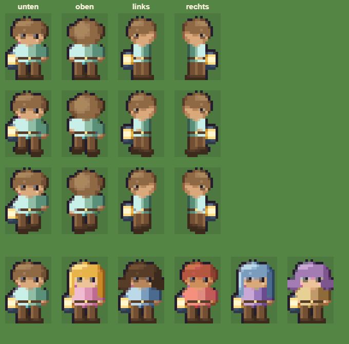

The adventurer, in four directions and three walk frames, drawn in code on the same closed palette as everything else. Every one of them carries a lantern — which is the story, and is also the one thing in the silhouette that no bush, rock or shrub has.

It took two passes, and the contact sheet earned its keep immediately. The first draft put a full-width fringe two pixels above the eyes, so every character had a dark bar across its face and read as a potato in a bowl cut. It gave the legs no gap, so the walk did not read at all. And it drew the side view as the front view with an extra eye, so three of the four directions were the same picture.

What fixed it: a forehead, three pixels of daylight between the legs, a genuinely narrower head in profile with a nose, and the lantern.

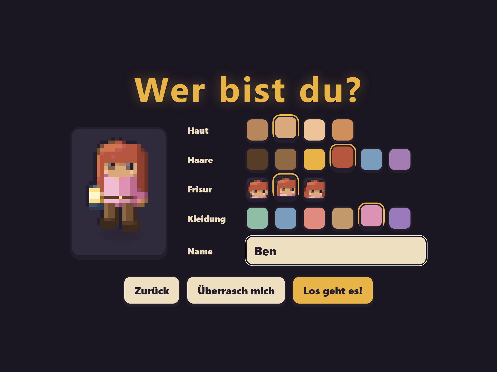

Three save slots, and a character editor that shows the character **walking** while you dress it, because that is how it will actually be seen.

Every outfit is offered to every character. Not for a political reason — for a practical one: a great many six-year-old girls want the armour, and a shop with a half marked "not for you" throws away half its own appeal.

The three slots also fix something the previous project had and never admitted: one device, one save. A brother, a classmate or a second go at a different character all had to overwrite the first.

The screenshot caught two things immediately. The hairstyle swatches were three identical cream squares, because a hairstyle has no colour of its own — they are little heads wearing the style in the character's current hair colour now. And the verification suite caught the colour swatches at 52×52, under the 64×64 floor that a six-year-old's finger needs.

## The icon, which is the first thing anyone sees

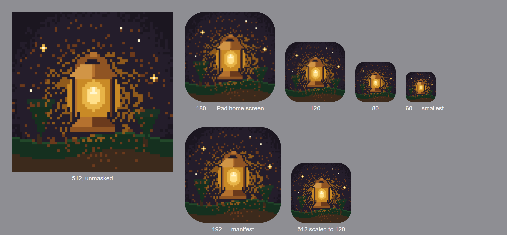

Funkelwelt started with the previous project's icon, because the whole
toolchain was copied wholesale. Two learning games with the same island
on the same home screen is a bug, and it is the kind that only shows up
on the device.

So: a lantern, alight, in a dark world. It is the entire story of the
game in one shape, and it is the one thing on that home screen that
does not look like every other rounded square.

Three things went into it that are worth stealing.

**Judge it at the size it is drawn.** The contact-sheet habit again, and
the same lesson as the sheep that read as white pebbles: the sheet
renders the icon at 180, 120, 80 and 60 pixels, behind the squircle iOS
actually masks it into, on home-screen grey. The first version had a
bright core in the glass *and* a flame, which at 512 looked like a lit
window and at 60 was one warm blob. Removing the brightest colour from
everywhere except the flame is what made it read as a lantern.

**Dither instead of gradient.** The pool of light around the lantern is
rings of scattered pixels, not a smooth falloff — because iOS
downsamples the icon and a smooth ramp turns to mush, while a dither
keeps its texture all the way down.

**Ship the sizes iOS asks for.** 152 on an iPad, 167 on an iPad Pro, 180
on an iPhone. None of those divides 64, so nearest-neighbour scaling
gives some source pixels three output pixels and others two — a visible
stagger along every straight edge, and this icon is nothing but straight
edges. They are scaled up to an exact 512 first and then box-filtered
down, so each output pixel averages a whole block.

And then the promises became four assertions, because an icon is the one
part of the app no screenshot of the game ever shows: every referenced
icon exists, every one is square and is the size its `sizes` attribute
claims, an apple-touch-icon is offered at 180, and every icon is fully
opaque — iOS composites transparency onto black, so a transparent icon
looks perfect in every preview and is a black square on the home screen.

All four were watched failing first: a wrong `sizes`, a deleted file, a
single transparent pixel, and a missing 180 link. Two minutes, and the
alternative is finding out on someone else's iPad.

## What is still soft

Almost everything, and one thing in particular.

**A walkable overworld is a lot of game.** If the walking is not fun on its own, it is a corridor between quizzes and worse than a menu. That is the biggest risk in the whole design, and it is why the next thing built is the world itself, with nothing in it — so that a grown-up can walk around for two minutes and find out.

I would rather discover that now than after four dungeons are standing on top of it.

---

# A world to walk in

*Devlog 0003. The plan said the walking was the biggest risk in the project, so the walking got built before anything was built on top of it. A lantern that turned out to be invisible, a character who was walking around inside a barrel, and 430 milliseconds that were not where anybody thought they were.*

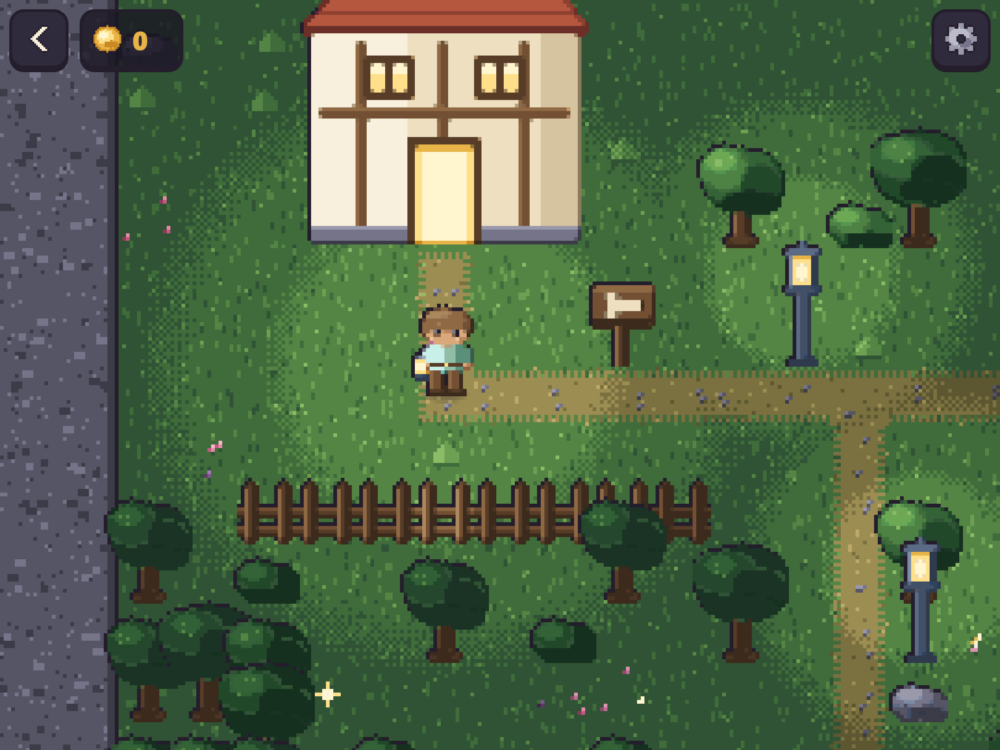

The plan for this game has one line in it that reads like a warning, because it is one:

> *If the walking is not fun on its own, it is a corridor between quizzes and worse than a menu.*

That is the whole risk of an RPG built around arithmetic. The theory is lovely — you meet something, you use what you know, you get stronger, you reach harder places — and it collapses entirely if the bit between the questions is boring. Then it is a quiz with a longer loading screen.

So the rule was: build the walking, put nothing else in it at all, and go and walk around for two minutes.

## The region is thirty-six lines of text

The first decision was the one I was least sure about, and it is settled now: **the world is authored, not generated.**

The argument for procedural generation in a small project is that it is cheap. The argument against it here is that a child should be able to say *the pond is past the big tree*, and mean it, and be right tomorrow. Hyrule is the same Hyrule for everybody. A world you can learn by heart is worth more than a world that is different every time, and for a six-year-old it is worth a great deal more.

So the first region is a text file. Forty-eight characters wide, thirty-six lines tall:

```
##.....================s~~~~~~~~~~~~~=...,....##
##.,..."......=...,....ss~~~~~~~~~~~s=t.......##
##..ffffffff..=.........ss~~~~~~~~~ss=..,.."",##
##T.t.....T...=T..T......ss~~~~~~~ss.=.......T##
```

`#` is cliff, `~` is water, `=` is path, `T` is a tree, `H` is the house, `*` is a lamp post, `F` is a lightspark. It can be read, edited and diffed by a person, which an array of 1728 numbers cannot. When I want the path to go somewhere else I move some equals signs.

The first draft came out of a throwaway script — I placed the pond and the stream and the wood deliberately and let it scatter the flowers — and its output is now the artifact. The script is gone. The text is the map.

**Method: make the agent's output a thing a human can edit.** The temptation with a generated world is to keep the generator and treat its output as a build artifact. Then every tweak is a conversation with the generator instead of a one-character edit. Generating the *first draft* and then throwing the generator away gave me something I can change in five seconds and the agent can change too.

The map also checks itself at load. Every row must be exactly 48 characters, there must be a house, and — the one that actually caught something — **the path must be a single connected run**, breadth-first from the tile the adventurer starts on. The first version had the path crossing the pond, because I had moved the pond and not the path. The assertion said `99 of 99 tiles reachable` on the version that shipped and something much less flattering on the version before it.

## The lantern was invisible

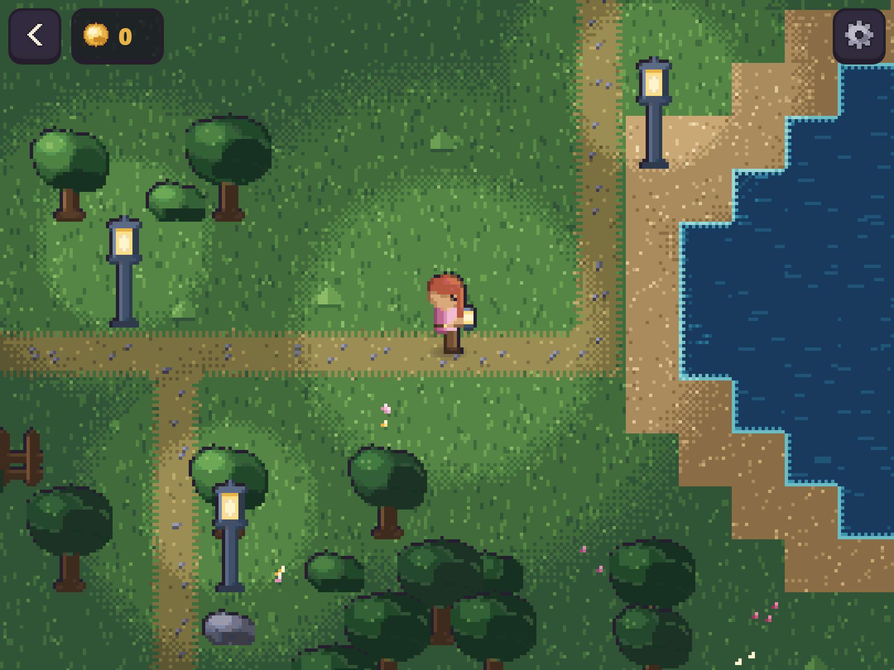

The fiction of this game is that the world has gone dim and a child arrives with a lantern and learns it bright again. I wanted that to be literal rather than a line of dialogue, and the way to do it is cheap: composite the whole region twice, once at full brightness and once a step darker, and show the bright copy only through a disc around the character.

It works, and you could not see it.

Here is where I would normally have started guessing. Instead — the rule this project keeps re-earning — I sampled the actual pixels of the actual frame. Grass next to the adventurer came back as `84,133,68`. Grass out in the dark came back as `63,108,58`.

So the lighting was working perfectly. The step was real, about twenty per cent, and it read as *nothing at all*.

The reason is that a single step gives you two states and no falloff, and the lit disc covered most of the screen, so there was nothing on screen to compare it against. The eye needs the gradient more than it needs the depth. The fix was a third copy of the region and a second, wider ring: dark, half, full. Two steps of shadow with a band between them, and suddenly there is a lantern.

**Method: sample the frame, do not squint at it.** "I can't see the effect" and "the effect isn't happening" are different bugs with different fixes, and eight lines of `getImageData` tells you which one you have. I would have spent the next twenty minutes debugging a compositing path that was already correct.

The falloff is dithered rather than smooth, and that is not nostalgia. This whole game is drawn from a closed palette of ramps, and a gradient overlay would put colours on screen that are not in it — which is exactly the thing that makes pixel art look like pixel art with a filter on top. A 4×4 ordered dither gives a soft edge out of nothing but *this pixel is lit or it is not*.

Then the lamp posts became light sources on the same mask, which cost about four lines and paid for itself immediately: the path is now literally lit, and following the lights is following the path. That is a signpost that needs no words, and the rule in this project is that no text may be load-bearing, because the child cannot reliably read yet.

## The sparks, and what they are allowed to pay

The playtest that started this whole project found two things: collecting worked, building did not. So there are ten **lightsparks** scattered off the path, in corners, and you pick one up by walking into it. Nothing to press.

They pay **coins**. They do not pay stars.

That distinction is the entire economy of the game and it is worth being pedantic about. Stars are the record of what a child has *learned* — they only ever go up, they are never spent, and they are what opens gates. Walking about is not learning. If wandering earned stars, the number that measures the child would stop meaning anything, and a number that measures a child and can be gamed is worse than no number.

There is a test in the suite that says exactly this: after picking up a spark, three coins and zero stars.

## The barrel

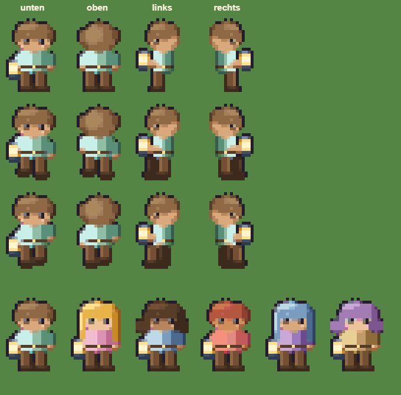

The adventurer was finished two weeks ago. Four directions, three walk frames, six looks. I had looked at the contact sheet and signed it off.

Then I walked him east for four seconds and he was moving around inside a barrel.

In profile, both legs were drawn at the same height, in the same colour, three pixels apart — so they merged into one brown block as wide as his body. And the lantern hung at hip height directly over the back leg, which in a side view *is* the walk cycle. So the walk did not read, and the thing he was carrying read as a briefcase.

The infuriating part is that this is the same bug the front view had, written down in this project's own learnings file — *legibility at small sizes comes from gaps, not from detail* — in the one direction the contact sheet had only ever been asked to show standing still. A standing profile with two legs in the same place looks completely correct. It is exactly right, in fact. It only breaks when it moves.

The fix: the legs swing forward and back rather than up and down, the far one is two steps darker so it reads as behind, and the lantern moved up to chest height and out in front, held at the end of a visible arm.

**Method: the contact sheet is not enough for anything that moves.** Review the sprite where it will be seen, at the size it will be seen, doing the thing it will be doing. A grid of poses will pass a walk cycle that does not work.

## 430 milliseconds, and the wrong theory

Opening the world took 430 ms. That is a title screen that has stopped responding, and whatever it is on a desktop it is worse on a five-year-old iPad.

My theory was the obvious one: the region is composited from 1728 tiles, twice over for the two frames of water ripple, so that is 3456 tile builds. Only the water differs between the frames, so I made the second frame a copy of the first with just the two hundred water tiles redrawn.

430 ms became 381 ms. Roughly a tenth of the problem, for the thing I was certain was the whole problem.

The actual cost was one line in a function I did not write today. Stepping the whole region down a ramp works by rewriting every pixel through a lookup, and the lookup was keyed on the colour's hex string — which meant building `#rrggbb` for every one of 442,368 pixels, four times, on every entry to the world. Nearly two million string constructions.

Keying the cache on the packed integer instead, and building the hex string only on a cache *miss*, took it to **155 ms**. Same picture, pixel for pixel.

**Method: measure before you fix, and treat a fix that did not move the number as information.** The tile optimisation was not wrong — it is still in there, it is still a saving. It just was not the bug, and I only know that because there was a number before and a number after. Two projects ago this same rule cost four wrong theories about a frame-time regression before anybody instrumented anything.

## Both steerings, because nobody knows

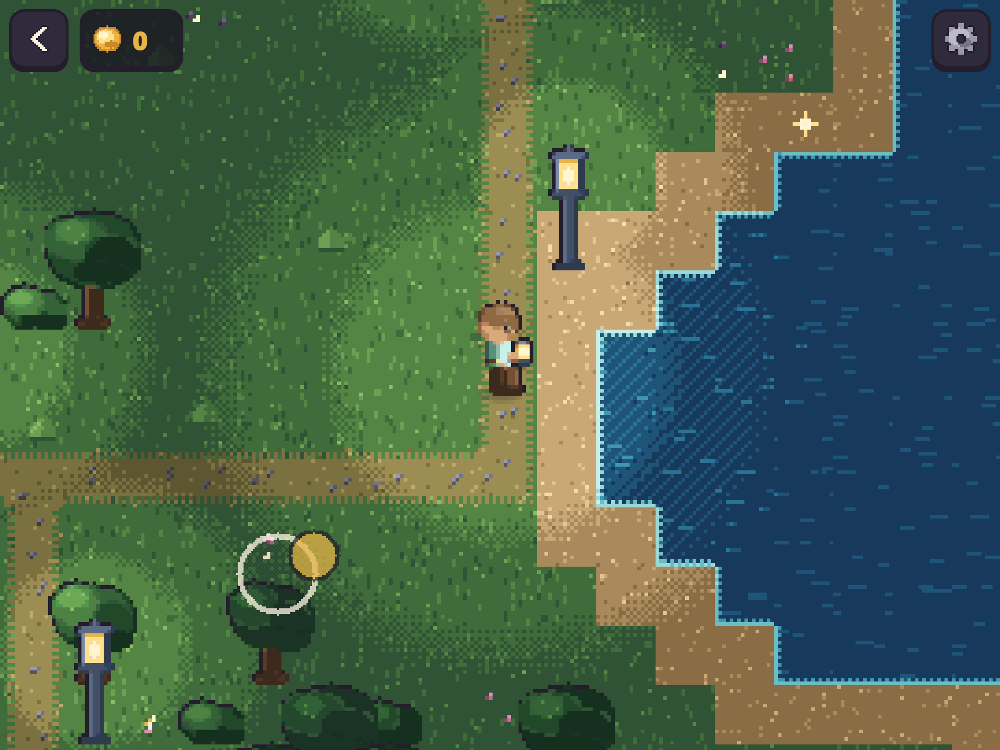

How should a six-year-old move a character on an iPad? A thumbstick, or tap-where-you-want-to-go?

I have opinions. Everyone has opinions. Nobody has data, and my son is right there.

So both are built, and the switch is two taps away *inside the world*, so it can be changed in the middle of walking and changed straight back. That is the only setup where a ninety-second comparison is actually possible.

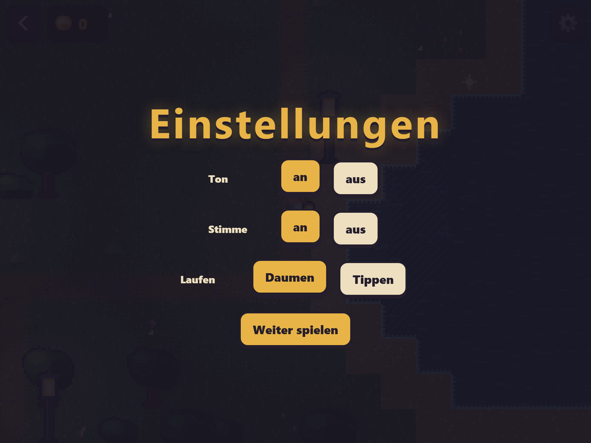

Two decisions inside the thumbstick that are about children rather than about input:

The direction is analogue and the **speed is not**. A small push walks at exactly the same pace as a big one. Analogue speed punishes a light touch by making the character crawl, and a child reads a crawling character as a broken one.

And only the **first finger down** owns the stick. A second finger is ignored rather than fighting it, because children put both hands on a tablet.

Tap-to-walk got a real breadth-first search over the tile grid rather than "walk towards the tap", and that was a deliberate call: the cheap version grinds along the edge of the pond when you tap the far bank, and it would have lost the comparison for a reason that has nothing to do with which control a child prefers. If you are going to run an experiment, do not rig it.

**Method: when the honest answer is "nobody knows", build both and put the switch where the experiment happens.** It cost maybe ninety minutes. Guessing wrong would have cost a rebuild.

## The tests, and the sabotage

There are eight new checks in the suite: he walks, walls are walls, the thumbstick moves him under a real touch event, tapping a spot walks him there, the steering choice is remembered, a spark can be picked up, it pays coins and not stars, and the world screen has a world in it.

Every one of them was watched failing first. Not as a formality — I broke the collision test, the stick's vector, the pathfinder, the position save, the settings write and the HUD, in four separate runs, and read the output each time. Four checks failed on the first sabotage, three on the second, one on the third.

That is where the interesting mistake of the day happened.

The first sabotage run ended with `git checkout -- src/` to put everything back. Which it did — including twenty minutes of work that was not committed yet. Six files of it, silently reverted, and I only noticed because the next build was missing an import.

**Method: commit before you sabotage.** Deliberately breaking your own code to check that your tests notice is a genuinely good practice, and it means you now have a "put it back" step, and "put it back" and "throw my work away" are the same command. Commit first and the sabotage is free.

There was a second one on the same run, and it is written in this project's rules file in so many words: *a failing typecheck means `dist/` was not rebuilt*. My first sabotage left an unused constant, the build failed, and the suite happily ran against the previous bundle and reported that everything was fine. I nearly believed it. That warning is in the rules file because it cost somebody two days on the last project, and it still very nearly worked on me.

## What is still soft

**The door does nothing.** There is a house on the map with a lit doorway on the path, and walking into it gets you a chime and a burst of sparks and nothing else, because the house is the next piece of work and inventing a room to put behind it would be worse than leaving it shut. A child will try that door in the first ten seconds. It is the most obvious thing on the screen.

**Nobody has run the two-minute test.** A grown-up walks around with nothing else in the game and does not get bored — that is the bar the plan set, and the person whose opinion matters is six and has not seen it yet. Everything above is a bet that the pond and the lamps and the sparks are enough. It might not be.

**The region is 48 by 36 tiles because I had to pick a number.** "Small enough to learn by heart" is the design goal and it is not a measurement. About nine iPad screens is my guess at it. It is a guess.

And there is one more thing I noticed and left alone: one of the six outfits is an ochre tunic almost exactly the value of one of the four skin tones, so that character reads as a blob. It has been there since the editor was built. Now that it is next to a lantern I can finally see it.

---

# The door opens

*Devlog 0004. Carrying a year of teaching across from the last project without rewriting a line of it, why the same round is now worth something different, and two tests that were quietly measuring the wrong thing — one of which failed loudly and one of which did not.*


There is a house on the map with a lit doorway, and until today walking into it got you a chime and nothing else. That was deliberate — inventing a room to put behind a door is worse than leaving it shut — but it was also the most obvious thing on the screen, and a child tries it in the first ten seconds.

So: the door opens.

## Not rewriting the teaching

The whole argument for this project being a new *frame* rather than a new app is that the teaching already exists. The previous project has four number houses, two writing houses, letters, syllables, first words, rhymes, shapes and patterns — all of it built, tested, and played with a real six-year-old. None of that needed doing again.

What that meant in practice was better than I expected. The ten-frame copied **verbatim** — same file, same path, not a line changed. So did the file that defines what a question is. The four number generators came across with their didactics intact:

> Concrete before abstract. Never show `7 + _ = 10` alone to a child at this stage. Show a ten-frame with seven cells filled: the gap is VISIBLE, and the child sees "three missing" before they can calculate it.

> The distractors are chosen, not random. A choice that is obviously wrong teaches nothing; a choice that is off by one teaches the child to look at the frame rather than to guess.

The only edit any of it needed was one import: `strengthOf` over there is `staerkeVon` here.

**Method: when you fork a project, make the agent tell you what it is NOT copying, and why.** I asked for the whole `src/games/` directory to come across. What came across was four files, and the header of the new one explains the omission in seven lines: the letters house drags a word list, the shapes house drags shape drawings, the writing houses drag a font, and together that is about forty kilobytes of source for doors that do not exist. Nobody can look at a house with no door, and this project's definition of done requires somebody to have looked. They cross when their doors do.

That is the kind of decision I want argued in the repo rather than made silently in either direction.

## The same round, worth something different


Here is where it is genuinely a different game.

Over on the old project a round paid **stars** and **sweets**, and stars unlocked houses. Here it pays **Mathe-Sterne** and **Münzen**, and the level bar for that subject moves.

The distinction is not cosmetic and it is the reason this frame exists:

**Sterne are per subject**, and they are the record of what has been *learned*. They only go up and they are never spent. A gate later in the world that wants Mathe 3 is a gate the child opened by knowing something — which is honest about what is actually true of them, and means a child who loves numbers and finds letters hard is visibly *good at something* rather than behind.

**Münzen are the spendable half**, and the lightsparks lying around the world pay those. Walking about earns coins. Only the house earns stars.

That line has to be enforced rather than intended, because it is exactly the kind of thing that erodes. So it is a test:

```
ok    a round pays Mathe-Sterne — 2 stars
ok    and never Wort-Sterne, which it did not teach
ok    and it pays coins rather than stars — +3 coins, stars 2/0 -> 2/0
```

If wandering around ever earns stars, the one number in this app that measures the child stops meaning anything, and a number that measures a child and can be gamed is worse than no number at all.

## Luma has a voice

The speech pipeline came across too, cut down. It is a build step, not a runtime call, and that is a rule rather than an optimisation: a learning game for a six-year-old that phones a speech API every time it opens a door would break the offline promise for every child in the class, and it would stop working on a train.

So it runs on my machine, writes fifteen MP3s into `assets/voice/`, and the running app has never heard of ElevenLabs. Four hundred kilobytes for the whole voice set. The suite still says the game talks to nobody, because that is a check on every request's origin rather than a sentence in a document.

The lines themselves are read out of the string table and nowhere else, which means **a line that is not in the table cannot be spoken** — the same rule the app enforces from the other side.

Two of them are worth quoting, because they are the design:

> *Fast. Sieh dir das Feld an.*
> *Das merkst du dir beim nächsten Mal.*

Those are what is said after a wrong answer. Not one of them says wrong. The ten-frame is already filling itself in with the partner that was actually needed — the correction is a *picture* — and a voice saying it again would be a grown-up pointing at it.

## Two tests that were measuring the wrong thing


This is the part worth reading.

**The one that failed loudly.** There was a check called *a wall is a wall — the house stops you at the doorstep*. It walked the adventurer north out of the doorway for three seconds and asserted he had not got far. It had passed all week.

The moment the door started opening, that check stopped measuring the wall and started measuring the door. It failed immediately and noisily — the whole run aborted, because the next line tried to tap a button on a screen that was no longer there.

That is the good outcome, and it is the argument for asserting on a saved coordinate rather than on a screenshot. A visual check would have kept passing while quietly meaning nothing. The check now walks *west into the side of the house* instead, and the comment above it says why it moved.

**The one that did not.** There was another: *and it pays coins rather than stars*, which asserted that after picking up a lightspark the child had three coins and zero stars.

Zero stars was true right up until a house round ran earlier in the same suite. Then it failed — and the failure was correct, but the check had been wrong the whole time. It was not asserting *sparks do not pay stars*. It was asserting *nothing else in this suite earned any*, which is a fact about the test file rather than about the game.

It now measures a difference: stars before, stars after, unchanged.

**Method: a test that asserts an absolute is usually asserting something about your test suite.** "Zero" and "empty" and "exactly one" are the phrasings to look at twice. What you almost always mean is "unchanged by this", and the two agree right up until they do not.

## The trap that got me twice in one afternoon

The rules file for this project has said, since day one:

> A failing typecheck means `dist/` was **not** rebuilt. Twice on the last project a measurement was taken against a stale bundle and believed.

Today it happened twice more. Both times during a sabotage run — deliberately breaking my own code to check that the tests notice.

The first time was the textbook version: my sabotage left an unused constant, the typecheck refused it, `dist/` kept the previous build, and the suite cheerfully reported that everything was fine. I nearly believed it.

The second was nastier. Same failed build — but this time `dist/` was holding the *previous sabotage*, not a good build. So the suite reported a mixture: some checks passing, some failing, all of it plausible, none of it about the code on disk. That is much harder to catch than an all-green run, because a mixed result looks like a real result.

A rule in a document did not stop it. So it is not a rule any more:

```
FAIL  dist/ is 23s older than src/ — the build did not run,
      so everything below would be measuring the previous one.
      Almost always a failing typecheck. Run `npm run build`.
```

Eight lines, runs before the browser starts, and I watched it fail before trusting it to pass.

**Method: when a written rule fails to stop something twice, it is not a rule, it is a wish.** Turn it into an assertion. This project has done that with "you cannot lose", with "nothing leaves the device", with "every button is 64 pixels" — and it had somehow left the one about its own build process as prose.

## What is still soft

**Nobody has played it.** This is now genuinely the whole loop — walk, find the door, answer ten things, come out stronger, watch the bar move — and the person it is for has still not seen any of it. Everything above is a bet.

**The house is one house.** The world has one door and the map has room for five more. Whether ten questions in a row is the right length, whether the walk between them is a pleasure or a chore, whether a six-year-old wants to go straight back in — those are all questions the design has answers for and no evidence about.

**The pairs to ten do not celebrate yet.** There is a function that knows when a pair has come good in *both* directions, which is the real definition of learning one, and at the moment it only fires a small burst of hearts. That is the thing this whole app is actually for, and it deserves more of a fuss than a round does.
