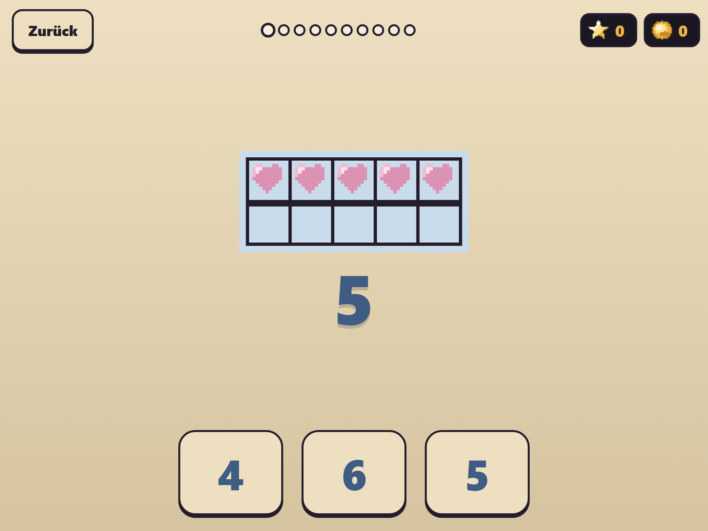
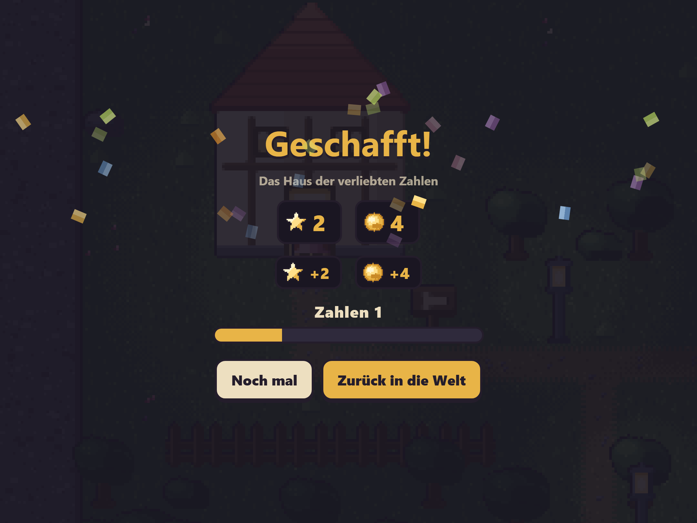
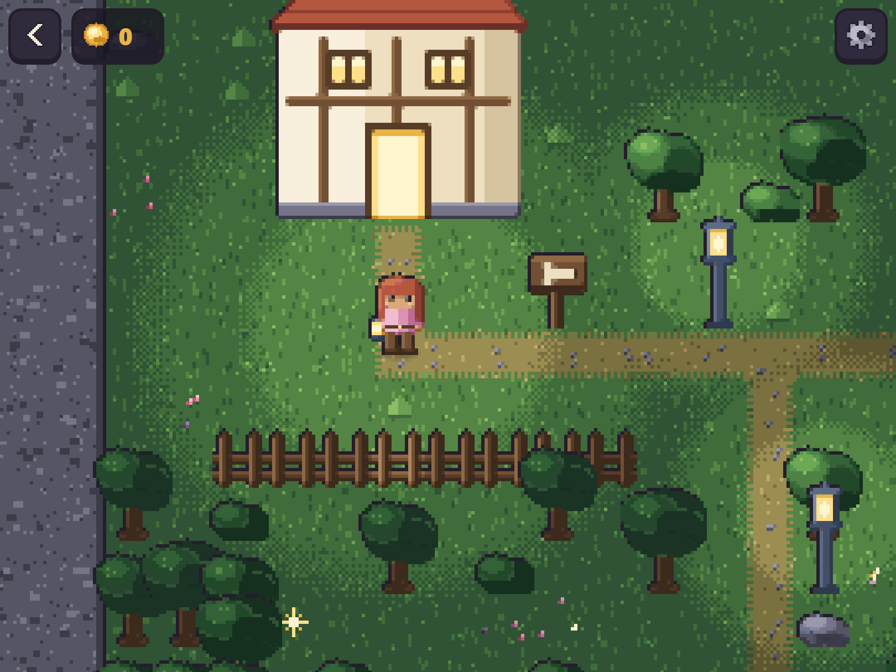

# The door opens

*Devlog 0004. Carrying a year of teaching across from the last project without rewriting a line of it, why the same round is now worth something different, and two tests that were quietly measuring the wrong thing — one of which failed loudly and one of which did not.*



There is a house on the map with a lit doorway, and until today walking into it got you a chime and nothing else. That was deliberate — inventing a room to put behind a door is worse than leaving it shut — but it was also the most obvious thing on the screen, and a child tries it in the first ten seconds.

So: the door opens.

## Not rewriting the teaching

The whole argument for this project being a new *frame* rather than a new app is that the teaching already exists. The previous project has four number houses, two writing houses, letters, syllables, first words, rhymes, shapes and patterns — all of it built, tested, and played with a real six-year-old. None of that needed doing again.

What that meant in practice was better than I expected. The ten-frame copied **verbatim** — same file, same path, not a line changed. So did the file that defines what a question is. The four number generators came across with their didactics intact:

> Concrete before abstract. Never show `7 + _ = 10` alone to a child at this stage. Show a ten-frame with seven cells filled: the gap is VISIBLE, and the child sees "three missing" before they can calculate it.

> The distractors are chosen, not random. A choice that is obviously wrong teaches nothing; a choice that is off by one teaches the child to look at the frame rather than to guess.

The only edit any of it needed was one import: `strengthOf` over there is `staerkeVon` here.

**Method: when you fork a project, make the agent tell you what it is NOT copying, and why.** I asked for the whole `src/games/` directory to come across. What came across was four files, and the header of the new one explains the omission in seven lines: the letters house drags a word list, the shapes house drags shape drawings, the writing houses drag a font, and together that is about forty kilobytes of source for doors that do not exist. Nobody can look at a house with no door, and this project's definition of done requires somebody to have looked. They cross when their doors do.

That is the kind of decision I want argued in the repo rather than made silently in either direction.

## The same round, worth something different



Here is where it is genuinely a different game.

Over on the old project a round paid **stars** and **sweets**, and stars unlocked houses. Here it pays **Mathe-Sterne** and **Münzen**, and the level bar for that subject moves.

The distinction is not cosmetic and it is the reason this frame exists:

**Sterne are per subject**, and they are the record of what has been *learned*. They only go up and they are never spent. A gate later in the world that wants Mathe 3 is a gate the child opened by knowing something — which is honest about what is actually true of them, and means a child who loves numbers and finds letters hard is visibly *good at something* rather than behind.

**Münzen are the spendable half**, and the lightsparks lying around the world pay those. Walking about earns coins. Only the house earns stars.

That line has to be enforced rather than intended, because it is exactly the kind of thing that erodes. So it is a test:

```
ok    a round pays Mathe-Sterne — 2 stars
ok    and never Wort-Sterne, which it did not teach
ok    and it pays coins rather than stars — +3 coins, stars 2/0 -> 2/0
```

If wandering around ever earns stars, the one number in this app that measures the child stops meaning anything, and a number that measures a child and can be gamed is worse than no number at all.

## Luma has a voice

The speech pipeline came across too, cut down. It is a build step, not a runtime call, and that is a rule rather than an optimisation: a learning game for a six-year-old that phones a speech API every time it opens a door would break the offline promise for every child in the class, and it would stop working on a train.

So it runs on my machine, writes fifteen MP3s into `assets/voice/`, and the running app has never heard of ElevenLabs. Four hundred kilobytes for the whole voice set. The suite still says the game talks to nobody, because that is a check on every request's origin rather than a sentence in a document.

The lines themselves are read out of the string table and nowhere else, which means **a line that is not in the table cannot be spoken** — the same rule the app enforces from the other side.

Two of them are worth quoting, because they are the design:

> *Fast. Sieh dir das Feld an.*
> *Das merkst du dir beim nächsten Mal.*

Those are what is said after a wrong answer. Not one of them says wrong. The ten-frame is already filling itself in with the partner that was actually needed — the correction is a *picture* — and a voice saying it again would be a grown-up pointing at it.

## Two tests that were measuring the wrong thing



This is the part worth reading.

**The one that failed loudly.** There was a check called *a wall is a wall — the house stops you at the doorstep*. It walked the adventurer north out of the doorway for three seconds and asserted he had not got far. It had passed all week.

The moment the door started opening, that check stopped measuring the wall and started measuring the door. It failed immediately and noisily — the whole run aborted, because the next line tried to tap a button on a screen that was no longer there.

That is the good outcome, and it is the argument for asserting on a saved coordinate rather than on a screenshot. A visual check would have kept passing while quietly meaning nothing. The check now walks *west into the side of the house* instead, and the comment above it says why it moved.

**The one that did not.** There was another: *and it pays coins rather than stars*, which asserted that after picking up a lightspark the child had three coins and zero stars.

Zero stars was true right up until a house round ran earlier in the same suite. Then it failed — and the failure was correct, but the check had been wrong the whole time. It was not asserting *sparks do not pay stars*. It was asserting *nothing else in this suite earned any*, which is a fact about the test file rather than about the game.

It now measures a difference: stars before, stars after, unchanged.

**Method: a test that asserts an absolute is usually asserting something about your test suite.** "Zero" and "empty" and "exactly one" are the phrasings to look at twice. What you almost always mean is "unchanged by this", and the two agree right up until they do not.

## The trap that got me twice in one afternoon

The rules file for this project has said, since day one:

> A failing typecheck means `dist/` was **not** rebuilt. Twice on the last project a measurement was taken against a stale bundle and believed.

Today it happened twice more. Both times during a sabotage run — deliberately breaking my own code to check that the tests notice.

The first time was the textbook version: my sabotage left an unused constant, the typecheck refused it, `dist/` kept the previous build, and the suite cheerfully reported that everything was fine. I nearly believed it.

The second was nastier. Same failed build — but this time `dist/` was holding the *previous sabotage*, not a good build. So the suite reported a mixture: some checks passing, some failing, all of it plausible, none of it about the code on disk. That is much harder to catch than an all-green run, because a mixed result looks like a real result.

A rule in a document did not stop it. So it is not a rule any more:

```
FAIL  dist/ is 23s older than src/ — the build did not run,
      so everything below would be measuring the previous one.
      Almost always a failing typecheck. Run `npm run build`.
```

Eight lines, runs before the browser starts, and I watched it fail before trusting it to pass.

**Method: when a written rule fails to stop something twice, it is not a rule, it is a wish.** Turn it into an assertion. This project has done that with "you cannot lose", with "nothing leaves the device", with "every button is 64 pixels" — and it had somehow left the one about its own build process as prose.

## What is still soft

**Nobody has played it.** This is now genuinely the whole loop — walk, find the door, answer ten things, come out stronger, watch the bar move — and the person it is for has still not seen any of it. Everything above is a bet.

**The house is one house.** The world has one door and the map has room for five more. Whether ten questions in a row is the right length, whether the walk between them is a pleasure or a chore, whether a six-year-old wants to go straight back in — those are all questions the design has answers for and no evidence about.

**The pairs to ten do not celebrate yet.** There is a function that knows when a pair has come good in *both* directions, which is the real definition of learning one, and at the moment it only fires a small burst of hearts. That is the thing this whole app is actually for, and it deserves more of a fuss than a round does.
