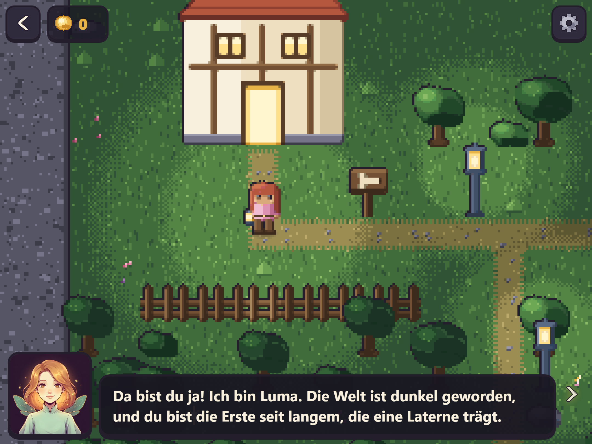
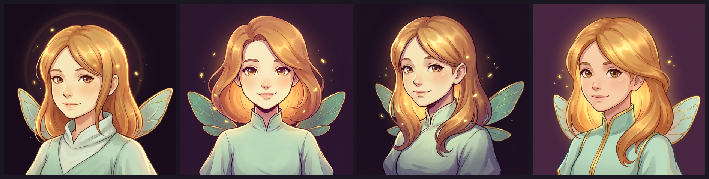
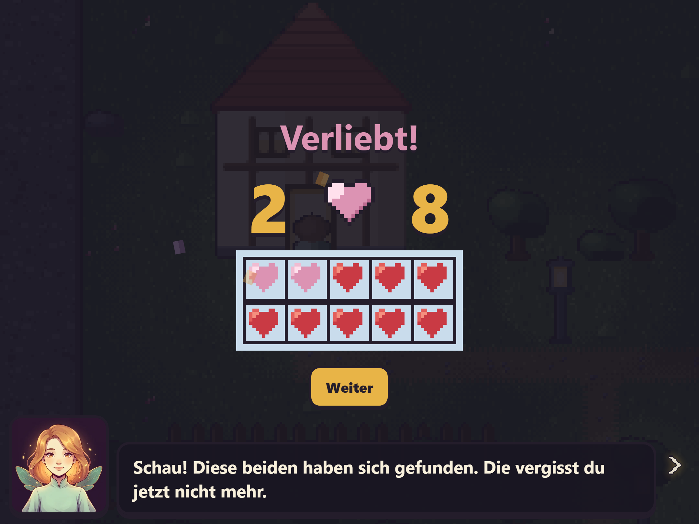

# A fairy, and the moment two numbers become friends

*Devlog 0005. Breaking the project's own most-defended rule on purpose, a celebration that had never once been reachable, and the single word in the script that would have told half the players the game had them wrong.*



The game has had a guide character in the design document since the first day and nothing to show for her. She had a name, a job, and fifteen recorded lines. She did not have a face.

## Breaking the rule

This project's rules file is emphatic about one thing above all others:

> **Every pixel is drawn in code**, on a closed palette — no image files except the generated home-screen icons.

That rule has earned itself. It is why a cherry tree and a fox and a little house drawn months apart still read as one world, and it is why a new outfit costs a colour ramp rather than a drawing.

I drew Luma that way first. Forty-six pixels square, wings, a halo, the works. It was legible, it was on-palette, and it was about as warm as a bus timetable.

Patrick's note was one line: *use Gemini for a way better fairy. Think Zelda, Final Fantasy, Persona. That direction please.*

He is right, and the reason he is right is worth being precise about, because "just use AI art" is not an argument. **She is not part of the world.** She is a painting in a box in *front* of it — which is exactly where Final Fantasy, Persona and every Zelda since Wind Waker put their illustrated art. Pixels in the world, a painting in the dialogue box. The contrast is the convention, not a mistake.

So the rule now has exactly one exception, written into the rules file with its reasoning, and ending with the sentence that keeps it from spreading: **anything that goes IN the world is still drawn in code.**

## What actually steers an image model



The first pass came back as three-quarter-body portraits of a young woman with no wings, and one of them had helpfully added a white picture frame. Perfectly nice, useless in a dialogue box.

The thing that fixed it was not more adjectives. It was writing the request as a **brief**: who she is, what she is for, where she will be seen — and then, doing more work than all the rest of it put together, a section headed MUST NOT.

```
CROP — this matters more than anything else here
HEAD AND SHOULDERS ONLY, filling the frame the way a passport
photograph does. The top of her hair almost touches the top edge.
Her chin sits at the vertical middle of the picture. Her shoulders
run off the left and right edges and are cut by the bottom edge.
Do NOT show her waist, her arms or her hands.
```

```
MUST NOT
No text, letters, numbers, logos, watermark or signature anywhere.
No frame, no border, no matte, no white edge, no vignette — the
painting bleeds to all four edges. No weapons. Nothing sexualised:
no exposed midriff, no low neckline, no cleavage. She is looked at
by young children and she is dressed like a storybook illustration.
No grim, edgy, gothic or melancholy treatment; she is warm.
```

That last block is not squeamishness. A prompt for "a fairy" without it comes back with something you would not hand a six-year-old, and it comes back that way by default.

**Method: make the model's output something you choose between, not something you accept.** `node tools/genluma.mjs --varianten` asks for four and writes them to a scratch folder; `--aus art_raw/luma-2.png` picks one and processes it. The choice is a line in the shell history rather than a file somebody dragged, and regenerating her is one command.

The old coded sprite is still there, as the fallback when the file is missing. It has a job now: it is the thing that proves the exception was worth making.

**25 kilobytes.** The same picture is 382 KB as a PNG and 25 KB as a WebP, because a soft painting with no flat areas is the exact case PNG is worst at. This app caches all of itself on install so it works on a train, so that difference is 357 KB of somebody else's first launch.

## Everything around her is the actual work

The portrait took an afternoon of prompt-writing. The rules about *when she is allowed to speak* took longer and matter more, because the design document's warning about her is sharper than its description of her:

> Luma must not talk too much. Text-heavy is exactly what makes children skip. Two sentences, spoken, and only when something has actually changed.

So: she says each line **once per adventurer, ever** — the save format has tracked that since before she existed, and it was put there for exactly this. The world **holds still** while she talks, because a character who wanders off behind the person explaining something is a character the child is watching instead of listening to. The box is **one enormous tap target**, because a six-year-old aiming at a small "next" arrow is a six-year-old tapping the world behind it. And she **goes away on her own** — the tap is an accelerator, not a toll gate.

There is one place she turns up uninvited. After three wrong answers in a round she appears, says *"Das ist knifflig, oder? Schau, ich zeig es dir"*, and from then on the ten-frame comes back for the rest of the round — even on facts the child had already got past needing it for.

That is what "help" means here. Not a hint, not a marked answer, not an easier question: **concrete before abstract, re-offered.** Nothing is taken away and nothing is recorded as a failure. And it happens once per round at most, because help that arrives every time a child slips is somebody standing over them.

## The celebration that had never once fired



Here is the good bug.

The whole app is really about one thing: knowing the pairs that make ten, in **both** directions, without working them out. There is a function that knows exactly when that has happened — both `7 → 3` and `3 → 7` at full strength — and finishing a round is supposed to check it and throw a party.

I built the party. Two numerals either side of a heart, the ten-frame underneath showing the fact in the same counters the child has been staring at, confetti, and Luma saying *"Schau! Diese beiden haben sich gefunden."*

Then I went to take a screenshot of it, and could not.

Six seeded attempts, each one ending with the pair provably complete in the save file and the celebration not firing. The code read perfectly:

```ts
const paareVorher = bekanntePaare();   // at the END of the round
// ... award stars ...
const neuePaare = bekanntePaare().filter((n) => !paareVorher.includes(n));
```

The facts are recorded as **each question is answered**. So by the time the payout asked "what is new", the pair had been known for three minutes, and the answer was always nothing. `paareVorher` is captured when the round *starts* now.

**Method: not being able to reach a screen is itself the bug report.** This project's second rule is "verify by looking, not by assuming", and it usually means *look at the thing and see what is wrong with it*. This is the other half: if you cannot get the thing on screen to look at, stop building and find out why. Nothing about that code would have failed a review.

There is a sting in the tail. That one-line fix was then silently reverted — `git checkout -- src/` after a sabotage run, for the **third time in one session**, taking back an uncommitted change along with the deliberate breakage. The screenshot that had just started working stopped working, and the next half hour went into re-debugging a bug I had already fixed. The rule in the rules file said "commit before you sabotage". It now says commit before *every* one of them, including the third, including when the change feels too small to bother.

## Juice

Patrick's other note was two words: *add juice everywhere.*

The constraint that makes this interesting is the art-direction rule the project has carried from the start: *nothing flashes, pulses or demands; when something wants attention it ARRIVES rather than alerts.* Which sounds like a rule against juice and is not. It is a rule against juice **the app starts on its own**. Everything below is a response to something the child just did, and none of it fires on a mistake.

* **Dust off the feet**, twice a second while walking. The cheapest effect in the game and the one that does the most: without it he is a picture being moved across a picture, and with it he is somebody walking on ground.
* **The lantern breathes**, on two slow sines that do not share a period — so it never settles into a rhythm you could count. A light that pulses regularly is a warning light; this one is a flame. One world pixel of wander, enough to see and not enough to notice.
* **Three pixels of shake and a puff of dust** stepping through the door, which is the only moment in the world with any weight to it.
* **Coins fly from a lightspark into the purse** and nudge it as they land. The playtest that started this whole project found that collecting worked — this is the part of collecting that worked.
* **The three children on the title screen walk on the spot.** Three motionless portraits are a menu; three children shifting their weight is a game waiting for somebody.

## One word

The last note was the smallest and possibly the best:

> One little note about the text — shall we use "das erste Kind, das eine Laterne trägt" instead of "die" or "der"?

Luma's welcome line said *"du bist die Erste seit langem, die eine Laterne trägt"*. **Die Erste.** The first — feminine.

Every other line in the table is already genderless. The character editor deliberately offers every outfit to every child, and that is a stated design decision with a paragraph of reasoning behind it. And then the very first sentence the game speaks aloud, before a child has done anything at all, quietly told half of them it had them wrong.

German gives you the fix for free: make the noun neuter and the relative pronoun follows. *Das erste Kind, das eine Laterne trägt.* Same length, same rhythm, one re-recorded line.

**Method: read the script out loud as somebody who is not you.** Every automated check in this project passed on that sentence. It is in the string table, it is spoken aloud, it is two sentences, it is warm, and it is wrong for half the people who will hear it. No test finds that.

## What is still soft

**Still nobody has played it.** Four devlog entries in a row have ended this way and it is becoming the actual finding: the loop is whole, the fairy has a face, the pairs have a party, and the six-year-old it is all for has not seen a frame of it.

**She has one expression.** She says the difficult line and the delighted line with the same face. Two more portraits from the same brief would cost about ten minutes, and I do not yet know whether it would be worth it or whether it would just be more machinery.

**The help is untested on a child who actually needs it.** Three wrong answers is a number I made up. It might be two. It might be that a child who has got three wrong wants the fairy to leave them alone.
