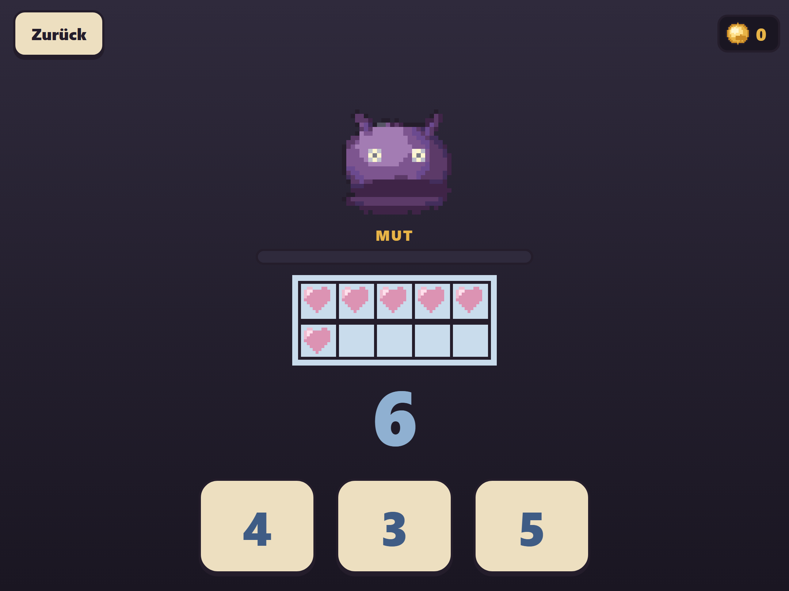
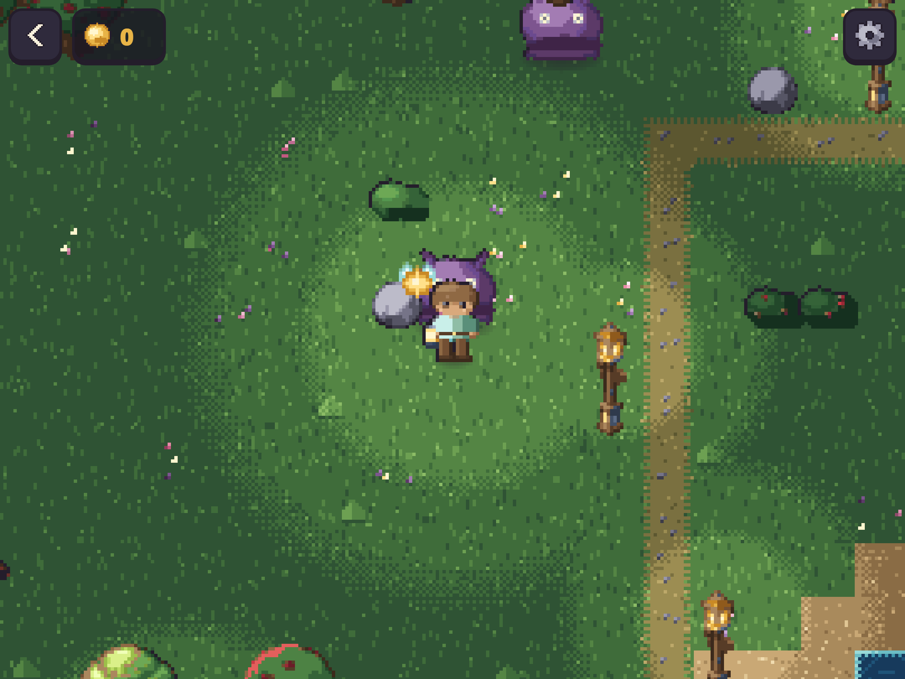

# The shadows, and the rule they exist to test

*Devlog 0006. Building the monster that must not be a monster, an assertion that guards the most important decision in the project — and the sabotage run that proved it was guarding nothing.*



Every other piece of this game has now been built. The last one is the fight, and this game's fight is the part the design document spends the most words on — because it is the part where an ordinary role-playing game would do something genuinely harmful.

> An RPG says: get it wrong, take damage, and eventually lose. Applied to a maths question that reads as *not knowing this hurts you*, which is precisely the lesson that makes a child decide at seven that they are bad at maths.

So: no health bar. What there is instead is **Mut** — courage — and it only ever fills.

## The monster that must not be a monster

The design brief for the creature is one sentence: *not dangerous, not threatening: dim.*

It has no teeth, no claws, no spikes and nothing red. It is a soft dark shape with two worried eyes that got braver than it should have while the lights were out, and what happens to it is that it is **chased away** — never killed, never hurt, never defeated.

That distinction is not squeamishness. A six-year-old answering arithmetic to make something suffer has been taught something about arithmetic. A six-year-old answering arithmetic to turn the lights back on has been taught something else.

It is drawn from the one ramp in the palette that is dark without being ink, so it reads as *absence of light* rather than as a black sticker. Its eyes come from the `glow` ramp — the family reserved in this project for lit things, lanterns and windows and coins. Even the shadow has a little of the light in it, which is precisely why it can be sent home rather than ended.

The first version had its under-shading as a small ellipse set fairly high in the body. On a round purple shape with two eyes above it, that is not shading. That is an **open mouth**. The one thing in this game that must not be a monster was a monster, and it took putting sixteen of them on a contact sheet to see it.

**Method: give the sprite an axis and render the whole axis.** The contact sheet for this one is four animation frames across and four stages of being pushed back down. It has to read as dim and never as hurt at all sixteen, and you cannot tell that from the one frame you happened to be looking at.

## Walked into, never sprung



Seven shadows stand in the dim corners of the map, off the path, and they are **not solid**. You see one from across the meadow and you decide about it.

That is the design document arguing with Pokémon:

> Random encounters can become an interruption tax. In Pokémon they are famously annoying. They have to be rare, brief, and always optional-feeling — probably visible on the map and walked into on purpose, rather than sprung out of the grass.

And when one is chased away it leaves a **light** where it stood. Permanently. Clear all seven and the region is measurably brighter — which is the progress bar the design asked for and could never quite name: *visible without being numeric*, at the scale of the whole world.

## Four assertions, and the one that was decorative

The encounter screen has exactly two numbers on it and both go one way. Mut rises; how awake the shadow is falls. `mut` is written in one place in the whole file and the only operator applied to it is `+`.

But "we wrote it carefully" is not a guarantee. So:

```
ok    a wrong answer costs nothing at all — Mut does not move
ok      …the shadow does not advance
ok      …no coin is taken
ok      …and nothing on the screen turns red
```

Then, per this project's fourth rule, I broke it on purpose — the exact mistake an RPG framing would make:

```ts
lauf.mut = Math.max(0, lauf.mut - 1);   // on a miss
```

**And the check passed.**

It answered the wrong question *first*, on an empty bar. `Math.max(0, 0 - 1)` is `0`. There was nothing there to take, so nothing was taken, so the assertion guarding the single most important decision in the project was decorative and had been from the moment it was written.

It answers one right first now, so Mut is at twenty per cent when the miss lands — and it also asserts that the reading it is comparing is not zero, so it can never quietly slide back into the same hole.

```
FAIL  a wrong answer costs nothing at all — Mut does not move — 20% -> 0%
```

**Method: a check that something is not taken away has to run from a state where there is something to take.** The empty inventory passes every theft test ever written. This is the third time this session that the same shape of mistake has turned up — a check that asserted zero when it meant *unchanged* — and it is now three entries in the learnings file under three different disguises.

The wider point is about rule 4 itself. "A new test must be seen to fail before it is trusted to pass" sounds like bookkeeping. It is not. It is the only thing that tells you whether an assertion is load-bearing or ornamental, and I would have shipped four ornamental ones on the most important screen in the game.

## Leaving is free

One more thing the design was insistent about, and it came from Patrick in the original conversation rather than from me: *wir müssen uns nur kurz ausruhen.*

There is no defeat. Walk out of an encounter halfway through and the shadow is still exactly where it was, at full strength, and nothing has been taken. That is a check too, because "you can always leave" is the kind of promise that quietly stops being true.

## What is still soft

**A sprite sheet that works and is switched off.** The generated adventurer came out well at 34 pixels — three directions, three walk frames, one consistent child with a lantern. It is not wired in, because sampling it against the palette showed hair, tunic and boots had all landed on the same ramp, so no recolour can keep the character editor's four sliders. Generated art is a photograph of a decision, not the decision. The likely answer is presets instead of sliders — *which one is you* is an easier question for a six-year-old than four sliders anyway — but that is Patrick's call and not mine.

**Still nobody has played it.** Six entries. The loop is now completely whole: a picture and a button, a slot, a character, waking up in the dark, a fairy who explains and then keeps up, a world that lights as you walk it, a house full of arithmetic, and seven shadows to chase off. And the person it is for has not seen one frame of it.

That has stopped being a caveat and started being the finding.
